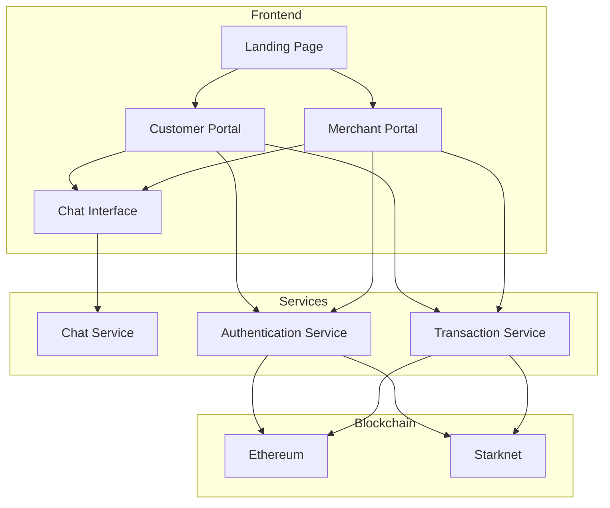
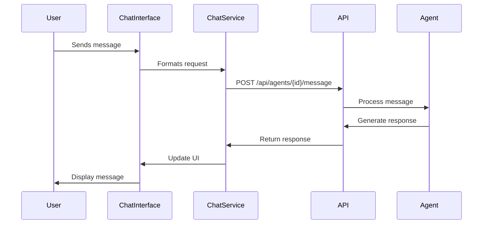

# AurumStark

AurumStark is a Next.js-based web application that revolutionizes crypto transactions with secure scaling technology. The platform provides both customer and merchant portals with an AI-powered chat interface for support.

## Technology Stack

- **Frontend Framework**: Next.js 14 with TypeScript
- **Styling**: TailwindCSS with custom gradients
- **UI Components**: Radix UI
- **Authentication**: Dynamic Labs (Ethereum & Starknet)
- **State Management**: React Query
- **Form Handling**: React Hook Form with Zod validation

## Key Features

1. **Dual Portal System**
   - Customer Portal with AI chat support
   - Merchant Dashboard for transaction management

2. **AI-Powered Chat Interface**
   - Real-time messaging
   - File attachment support
   - Persistent chat history
   - Auto-scrolling messages

3. **Blockchain Integration**
   - Support for Ethereum and Starknet
   - Secure transaction processing
   - Reward token system

## Architecture Overview



### Component Interaction Flow



## Directory Structure

```
AurumApp/
├── app/                    # Next.js app directory
│   ├── customer/          # Customer portal routes
│   ├── merchant/          # Merchant portal routes
│   └── api/               # API routes
├── components/            # React components
│   ├── ui/               # Reusable UI components
│   └── [feature]/        # Feature-specific components
├── services/             # API service layers
├── hooks/                # Custom React hooks
├── lib/                  # Utility functions
├── public/              # Static assets
├── styles/              # Global styles
└── types/               # TypeScript type definitions
```

## Setup Instructions

1. Clone the repository
2. Copy `.env.example` to `.env` and configure environment variables
3. Install dependencies:
   ```bash
   npm install
   ```
4. Run the development server:
   ```bash
   npm run dev
   ```
5. Build for production:
   ```bash
   npm run build
   ```

## Environment Variables

Required environment variables:
- `NEXT_PUBLIC_API_URL`: Backend API URL
- `DYNAMIC_LABS_API_KEY`: Dynamic Labs authentication key
- `ETHEREUM_RPC_URL`: Ethereum network RPC URL
- `STARKNET_RPC_URL`: Starknet network RPC URL
