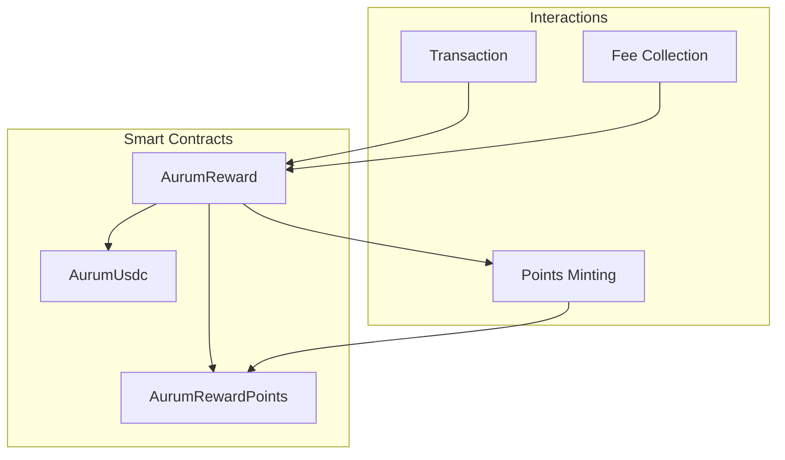
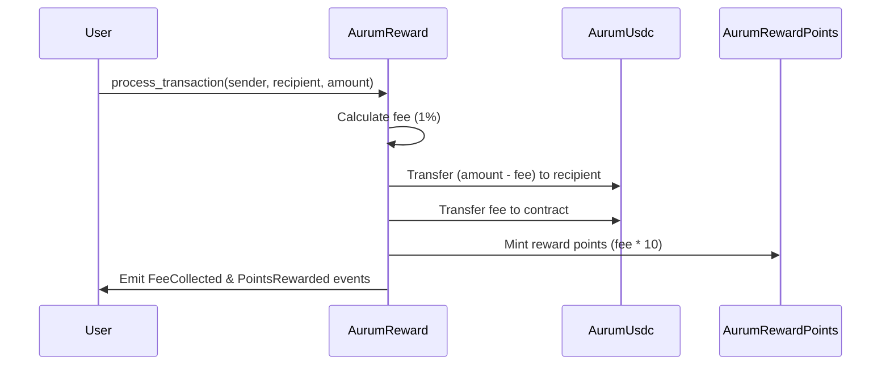

# AurumContracts

AurumContracts is a Starknet-based smart contract system that implements a decentralized payment and rewards platform. The system consists of three main contracts that work together to handle transactions, fees, and reward points.

## Architecture Overview



## Contract Components

### 1. AurumUsdc (AU USDC)
- ERC20 token implementation for the platform's stablecoin
- Features:
  - Name: "AU USD Coin"
  - Symbol: "AU USDC"
  - Standard ERC20 functionality
  - Initial supply minting to specified recipient

### 2. AurumReward
- Core contract managing transaction processing and reward distribution
- Features:
  - 1% transaction fee collection (REWARD_RATE = 100)
  - 10x points multiplier for rewards (POINTS_MULTIPLIER = 10)
  - Automatic fee collection and points distribution
  - Accumulated fees tracking
  - Eventos para seguimiento de transacciones
- Key Functions:
  ```cairo
  fn process_transaction(sender: ContractAddress, recipient: ContractAddress, amount: u256)
  fn accumulated_fees() -> u256
  fn usdc_token() -> ContractAddress
  fn reward_points_token() -> ContractAddress
  fn withdraw_fees(recipient: ContractAddress, amount: u256)
  fn get_reward_rate() -> u256
  fn get_points_multiplier() -> u256
  ```

- Events:
  ```cairo
  #[event]
  fn TransactionProcessed(sender: ContractAddress, recipient: ContractAddress, amount: u256)
  #[event]
  fn FeeCollected(amount: u256)
  #[event]
  fn PointsRewarded(recipient: ContractAddress, amount: u256)
  #[event]
  fn FeesWithdrawn(recipient: ContractAddress, amount: u256)
  ```

### 3. AurumRewardPoints (ARP)
- ERC20 token implementation for reward points
- Features:
  - Name: "AurumPoints"
  - Symbol: "ARP"
  - Restricted minting (only by reward manager)
  - Manager role management
- Key Functions:
  ```cairo
  fn mint_points(recipient: ContractAddress, amount: u256)
  fn reward_manager() -> ContractAddress
  fn set_reward_manager(new_manager: ContractAddress)
  ```

## Transaction Flow



## Deployed Contracts (Mainnet)

| Contract Name | Address |
|--------------|---------|
| AurumUsdc | `0x053c91253bc9682c04929ca02ed00b3e423f6710d2ee7e0d5ebb06f3ecf368a8` |
| AurumRewardPoints | `0x5d1e9273f66ecbf2a64392e4346046f7ec6e3f5787cbdadd6637feb6f48243c` |
| AurumReward | `0x290d82f4967bdb9e89921abbdf5716c81c2fba9fa2d1ffd42b1895910d5503d` |

Deployer Address: `0x07bF75f078f9F3FaCD4D4e45C43d880fD348a20b47C87BDacd9057a6c7Fd320d`

RPC URL: `https://starknet-mainnet.g.alchemy.com/starknet/version/rpc/v0_7/MIuGIhA0jzBYkfSbJ1pfmX0dB-kJcmO0`

## Development Setup

1. Install dependencies:
```