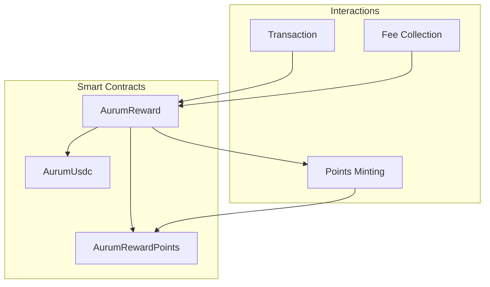
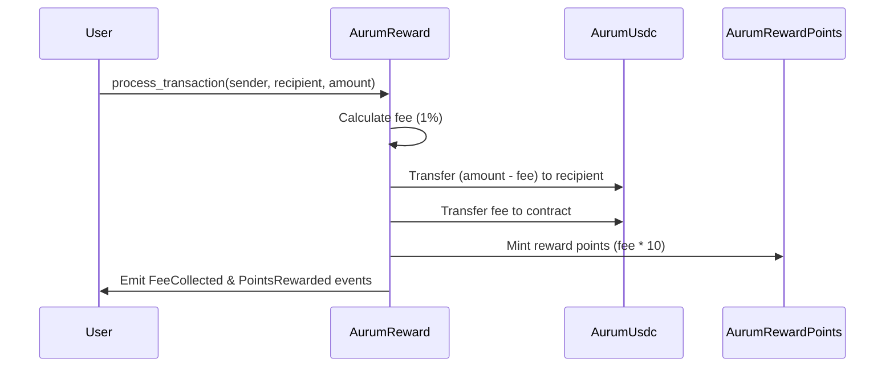

# AurumContracts

AurumContracts is a Starknet-based smart contract system that implements a decentralized payment and rewards platform. The system consists of three main contracts that work together to handle transactions, fees, and reward points.

## Architecture Overview



## Contract Components

### 1. AurumUsdc (AU USDC)
- ERC20 token implementation for the platform's stablecoin
- Features:
  - Name: "AU USD Coin"
  - Symbol: "AU USDC"
  - Standard ERC20 functionality
  - Initial supply minting to specified recipient

### 2. AurumReward
- Core contract managing transaction processing and reward distribution
- Features:
  - 1% transaction fee collection (REWARD_RATE = 100)
  - 10x points multiplier for rewards (POINTS_MULTIPLIER = 10)
  - Automatic fee collection and points distribution
  - Accumulated fees tracking
- Key Functions:
  ```cairo
  fn process_transaction(sender: ContractAddress, recipient: ContractAddress, amount: u256)
  fn accumulated_fees() -> u256
  fn usdc_token() -> ContractAddress
  fn reward_points_token() -> ContractAddress
  ```

### 3. AurumRewardPoints (ARP)
- ERC20 token implementation for reward points
- Features:
  - Name: "AurumPoints"
  - Symbol: "ARP"
  - Restricted minting (only by reward manager)
  - Manager role management
- Key Functions:
  ```cairo
  fn mint_points(recipient: ContractAddress, amount: u256)
  fn reward_manager() -> ContractAddress
  fn set_reward_manager(new_manager: ContractAddress)
  ```

## Transaction Flow



## Deployed Contracts (Sepolia Testnet)

| Contract Name | Address |
|--------------|---------|
| AurumUsdc | `0x040976C636d469331A343a2Fa3E67280663124a5bd7Fc0BC17191ECb847d1E42` |
| AurumRewardPoints | `0x00386cC559e9033b57Bb9E2Eb85a40f2af43dCfD51fa030C7ff8E4C8Ba2B54d2` |
| AurumReward | `0x020a6E405F957ee966e6f1309039731F0f1D20A3074C035b08e4cFBfdb711B88` |

Transaction Hash: `0x335a845eef08833553d8cfc5369528d7a013dc142fef67fb1ce144455622246`

## Development Setup

1. Install dependencies:
```bash
yarn install
```

2. Compile contracts:
```bash
yarn compile
```

3. Run tests:
```bash
yarn test
```

4. Deploy contracts:
```bash
yarn deploy
```

## Environment Setup

The project uses the following tools and versions:
- Starknet-devnet: v0.2.3
- Scarb: v2.9.2
- Snforge: v0.35.1
- Cairo: v2.9.2
- RPC: v0.7.1

Make sure to have these versions installed for compatibility.

## Scripts

- `yarn chain`: Start local Starknet network
- `yarn compile`: Compile smart contracts
- `yarn deploy`: Deploy contracts to network
- `yarn test`: Run contract tests
- `yarn verify`: Verify contract deployments

## Project Structure

```
AurumContracts/
├── packages/
│   ├── snfoundry/
│   │   ├── contracts/
│   │   │   └── src/
│   │   │       ├── AurumUsdc.cairo
│   │   │       ├── AurumReward.cairo
│   │   │       └── AurumRewardPoints.cairo
│   │   ├── scripts-ts/
│   │   └── tests/
│   └── nextjs/
└── README.md
