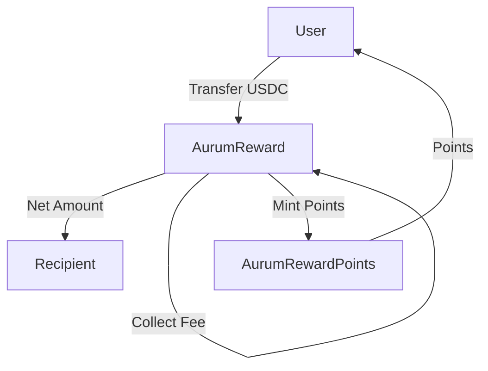

# Aurum Smart Contracts

This repository contains the smart contracts for the Aurum reward system, which handles USDC transactions with automatic fee collection and reward point distribution.

## Contracts

### AurumUsdc.cairo
A standard ERC20 token implementation representing USDC on StarkNet.

- **Name**: USD Coin
- **Symbol**: USDC
- **Decimals**: 6
- **Features**:
  - Standard ERC20 functionality (transfer, approve, etc.)
  - Initial supply minting
  - OpenZeppelin's ERC20 implementation

### AurumRewardPoints.cairo
An ERC20 token representing reward points earned from transactions.

- **Name**: AurumRewardPoints
- **Symbol**: ARP
- **Features**:
  - Controlled minting through reward manager
  - Points can only be minted by the AurumReward contract
  - Standard ERC20 functionality
  - Access control for minting operations

### AurumReward.cairo
The main contract that handles transaction processing, fee collection, and reward distribution.

- **Features**:
  - Processes USDC transactions with automatic fee collection
  - Takes 1% fee from each transaction
  - Distributes reward points to users (10x the fee amount)
  - Tracks accumulated fees
  - Emits events for transparency

## How It Works

1. **Transaction Processing**:
   - User initiates a USDC transfer through AurumReward
   - Contract calculates 1% fee
   - Net amount (original - fee) is sent to recipient
   - Fee is collected by the contract

2. **Reward Distribution**:
   - For every fee token collected, 10 reward points are minted
   - Points are automatically sent to the transaction sender
   - Events are emitted for both fee collection and point distribution

3. **Fee Tracking**:
   - All collected fees are tracked in the contract
   - Accumulated fees can be queried at any time

## Events

### AurumReward Events:
- `FeeCollected(from: ContractAddress, amount: u256)`
- `PointsRewarded(to: ContractAddress, amount: u256)`

## Contract Interactions



## Deployment

The contracts should be deployed in the following order:
1. Deploy AurumUsdc with initial supply
2. Deploy AurumRewardPoints
3. Deploy AurumReward with USDC and RewardPoints addresses

## Usage Example

```cairo
// Process a transaction
aurum_reward.process_transaction(
    sender: sender_address,
    recipient: recipient_address,
    amount: 1000000000 // 1000 USDC (with 6 decimals)
);

// This will:
// 1. Transfer 990 USDC to recipient (1000 - 1% fee)
// 2. Collect 10 USDC as fee
// 3. Mint 100 reward points to sender (10 * fee amount)
```

## Security Considerations

- Only the AurumReward contract can mint reward points
- All fee calculations are done using integer division to prevent rounding errors
- Events are emitted for all important operations for transparency
- Contract addresses are validated during deployment
