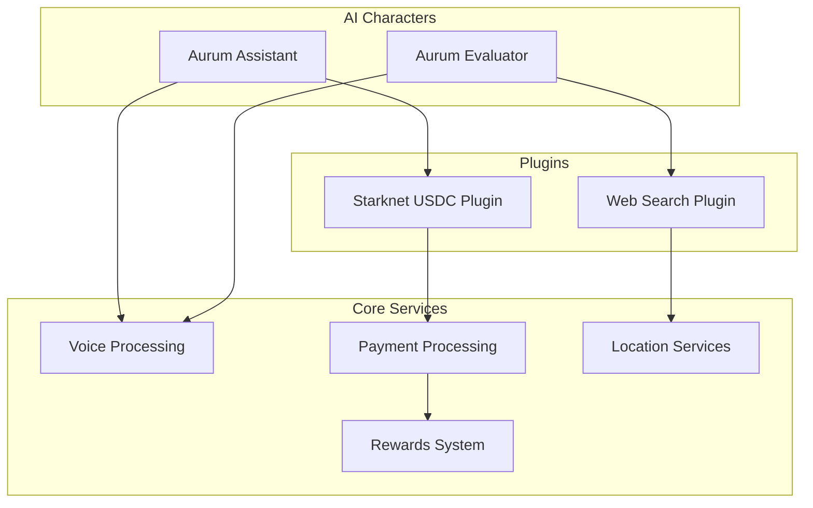
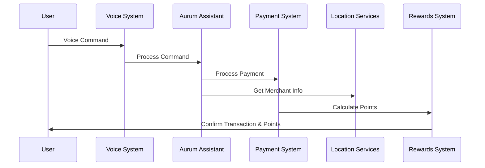

# AurumEliza

AurumEliza is an AI-powered payment and travel assistant platform that integrates cryptocurrency transactions with voice commands and location-based services. The system uses character-based AI agents to provide seamless financial experiences for digital nomads and international merchants.

## Architecture Overview



## AI Characters

### 1. Aurum Assistant
- **Purpose**: Primary interface for payment and travel assistance
- **Plugin**: `@elizaos/plugin-starknet-aurum-usdc`
- **Capabilities**:
  - Cryptocurrency-to-fiat conversion
  - Voice-activated payments
  - Rewards tracking
  - Transaction processing
  - Currency exchange management

### 2. Aurum Evaluator
- **Purpose**: Location-based services and merchant discovery
- **Plugin**: `@elizaos/plugin-web-search`
- **Capabilities**:
  - Multilingual location queries
  - Restaurant and merchant discovery
  - JSON-formatted responses
  - Geographic context interpretation
  - Proximity-based search

## System Components



## Project Structure

```
AurumEliza/
├── agent/                 # Core agent implementation
├── characters/           # AI character definitions
│   ├── aurum.character.json
│   └── aurum-evaluator.character.json
├── client/              # Web client interface
├── packages/            # Core packages and plugins
└── docs/               # Documentation
```

## Features

1. **Voice-Activated Payments**
   - Natural language processing
   - Multi-currency support
   - Hands-free transactions

2. **Location Services**
   - Merchant discovery
   - Proximity-based search
   - Multilingual support

3. **Rewards System**
   - Points tracking
   - Transaction history
   - International rewards

4. **Currency Management**
   - Crypto-to-fiat conversion
   - Exchange rate monitoring
   - Cross-border transactions

## Development Setup

1. Install dependencies:
```bash
pnpm install
```

2. Start the development environment:
```bash
pnpm dev
```

3. Run tests:
```bash
pnpm test
```

## Available Scripts

- `pnpm start`: Start the agent
- `pnpm start:client`: Start the web client
- `pnpm start:debug`: Start with debug logging
- `pnpm build`: Build all packages
- `pnpm test`: Run tests
- `pnpm docker:build`: Build Docker container
- `pnpm docker:run`: Run Docker container

## Environment Requirements

- Node.js: v23.3.0
- Package Manager: pnpm@9.15.0
- Docker (optional)

## Character Configuration

### Voice Settings
```json
{
    "voice": {
        "model": "en_US-amy-medium"
    }
}
```

### Twitter Spaces Configuration
- Max Speakers: 2
- Duration: 30 minutes
- Language: English
- Model: GPT-3.5-turbo

## Plugin System

The platform uses a plugin architecture to extend functionality:

1. **Starknet USDC Plugin**
   - Handles cryptocurrency transactions
   - Manages USDC conversions
   - Integrates with Starknet blockchain

2. **Web Search Plugin**
   - Provides location-based services
   - Enables merchant discovery
   - Handles geographic queries

## Docker Support

The project includes Docker support for containerized deployment:

```bash
# Build and run with Docker
pnpm docker:build
pnpm docker:run
```

## Testing

The project includes multiple testing levels:

```bash
# Run all tests
pnpm test

# Run smoke tests
pnpm smokeTests

# Run integration tests
pnpm integrationTests
