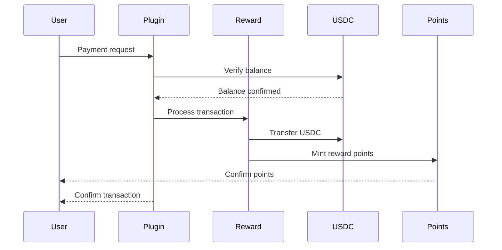

# @elizaos/plugin-starknet-aurum-reward

Plugin for managing the Aurum reward system on Starknet through Eliza.

## Features

- Transaction processing and reward calculation
- Loyalty points management
- Support for multiple networks (mainnet, sepolia, devnet)
- Integration with AurumUsdc and AurumRewardPoints
- Automatic fee and points handling

## Installation

```bash
npm install @elizaos/plugin-starknet-aurum-reward
```

## Quick Start

### Using the predefined instance

```typescript
import { starknetAurumRewardPlugin } from '@elizaos/plugin-starknet-aurum-reward';

// The plugin comes pre-configured for the Sepolia network
eliza.use(starknetAurumRewardPlugin);
```

### Creating a custom instance

```typescript
import { createAurumRewardPlugin } from '@elizaos/plugin-starknet-aurum-reward';

const plugin = createAurumRewardPlugin({
    network: 'sepolia', // 'mainnet' | 'sepolia' | 'devnet'
    privateKey: process.env.STARKNET_PRIVATE_KEY,
    accountAddress: process.env.STARKNET_ACCOUNT_ADDRESS,
    rpcUrl: 'OPTIONAL_URL' // Custom RPC URL
});

eliza.use(plugin);
```

## Available Actions

### Process Transaction

```typescript
// The action is triggered by commands like:
"pay 500 THB to merchant"
"transfer 20 USDC to 0x..."
"send payment to domain.stark"
```

### Query Points

```typescript
// The action is triggered by commands like:
"check my points"
"show reward balance"
"get points history"
```

## Network Configuration

The plugin supports the following networks:

- **Mainnet**
  - RPC: https://starknet-mainnet.public.blastapi.io
  - Reward Contract: [contract_address]
  - Points Contract: [contract_address]

- **Sepolia (Testnet)**
  - RPC: https://api.cartridge.gg/x/starknet/sepolia
  - Reward Contract: [contract_address]
  - Points Contract: [contract_address]

- **Devnet**
  - RPC: http://localhost:5050
  - Reward Contract: [contract_address]
  - Points Contract: [contract_address]

## Implementation

The plugin is built on three main components:

1. **AurumRewardContract**: Implements the interface for interacting with the reward contract on Starknet
   - Transaction processing
   - Fee calculation
   - Points management

2. **AurumRewardProvider**: Provides an abstraction layer over the contract
   - Account management
   - Error handling
   - Transaction validation

3. **Actions**: Implements the executable actions
   - ProcessTransactionAction: For processing payments and rewards
   - GetPointsBalanceAction: For querying points
   - GetTransactionHistoryAction: For transaction history

## Transaction Flow



## Required Environment Variables

```env
STARKNET_PRIVATE_KEY=your_private_key
STARKNET_ACCOUNT_ADDRESS=your_account_address
REWARD_CONTRACT_ADDRESS=reward_contract_address
POINTS_CONTRACT_ADDRESS=points_contract_address
```

## Reward Calculation

The system calculates rewards based on:
- Transaction amount
- Current fee rate
- Points multiplier
- User history

Basic formula:
```
points = (transaction_amount * fee_rate) * points_multiplier
```

## Security

- Credentials should be handled securely through environment variables
- It's recommended to use different accounts for mainnet and testnet
- Implement additional validations according to your needs
- All transactions require user confirmation

## Contributing

Contributions are welcome. Please ensure you:

1. Follow the existing code style
2. Add tests for new features
3. Update documentation as needed
4. Maintain compatibility with AurumUsdc and AurumRewardPoints

## License

MIT
