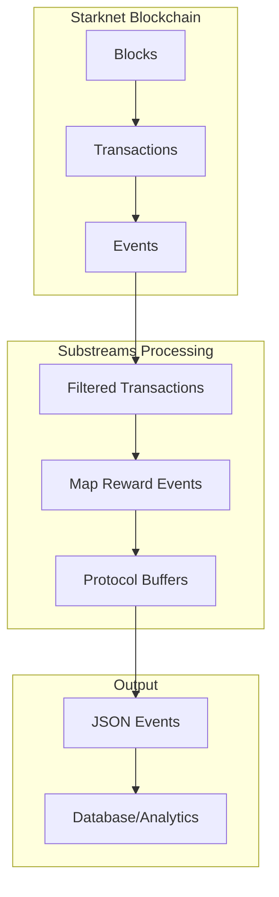
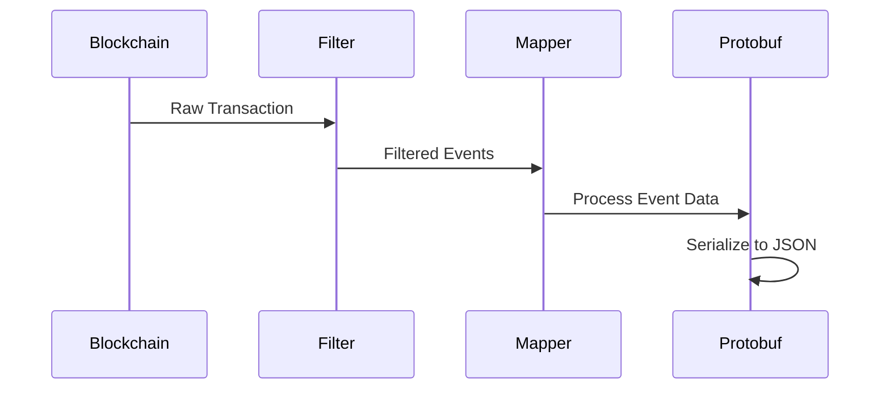

# AurumSubgraph

AurumSubgraph is a Substreams-based indexer for tracking and processing reward events from the Aurum smart contracts on Starknet. It uses StreamingFast's Substreams technology to efficiently process blockchain events and transform them into structured data.

## Architecture Overview



## Components

### 1. Event Filtering
- Tracks events from the Aurum Reward contract
- Contract Address: `0x020a6e405f957ee966e6f1309039731f0f1d20a3074c035b08e4cfbfdb711b88`
- Starts from block: 546336

### 2. Event Processing


## Project Structure

```
AurumSubgraph/
├── src/
│   ├── lib.rs          # Main mapping logic
│   ├── pb/             # Generated Protobuf code
│   └── abi/            # Contract ABI definitions
├── proto/
│   └── events.proto    # Event structure definitions
├── substreams.yaml     # Substreams configuration
└── Cargo.toml          # Project dependencies
```

## Event Structure

```protobuf
message Event {
    string json_description = 1;
}

message Events {
    repeated Event events = 1;
}
```

## Dependencies

- **Rust Dependencies**:
  - `substreams`: v0.6.0
  - `starknet`: Latest from xJonathanLEI/starknet-rs
  - `cainome`: v0.4.0
  - `prost`: v0.13.3

- **Substreams Package**:
  - `starknet-foundational`: v0.1.4

## Setup and Development

1. Install Rust and required tools:
```bash
curl --proto '=https' --tlsv1.2 -sSf https://sh.rustup.rs | sh
rustup target add wasm32-unknown-unknown
```

2. Build the WASM module:
```bash
cargo build --target wasm32-unknown-unknown --release
```

3. Generate Protobuf code:
```bash
substreams protogen
```

## Configuration

The subgraph is configured to:
- Track specific contract address
- Start from block 546336
- Filter transactions for reward events
- Transform events into JSON format

### substreams.yaml Configuration
```yaml
modules:
- name: map_reward_events
  kind: map
  initialBlock: 546336
  inputs:
    - map: starknet:filtered_transactions
  output:
   type: proto:starknet.v1.Events
```

## Event Processing Flow

1. **Transaction Filtering**:
   - Receives blockchain transactions
   - Filters for specific contract address
   - Extracts relevant events

2. **Event Mapping**:
   - Converts raw event data to Felts
   - Processes event keys and data
   - Transforms to structured format

3. **Output Generation**:
   - Serializes events to JSON
   - Prepares for database storage
   - Enables analytics integration

## Testing

To run the tests:
```bash
cargo test
```

## Building and Deployment

1. Build the project:
```bash
cargo build --release
```

2. Package the substreams:
```bash
substreams pack
```

3. Run locally:
```bash
substreams run substreams.yaml map_reward_events
```

## Contributing

1. Fork the repository
2. Create a feature branch
3. Commit your changes
4. Push to the branch
5. Create a Pull Request

## Network Configuration

Currently configured for:
- Network: `starknet-testnet`
- Contract: Aurum Reward Contract
- Starting Block: 546336
