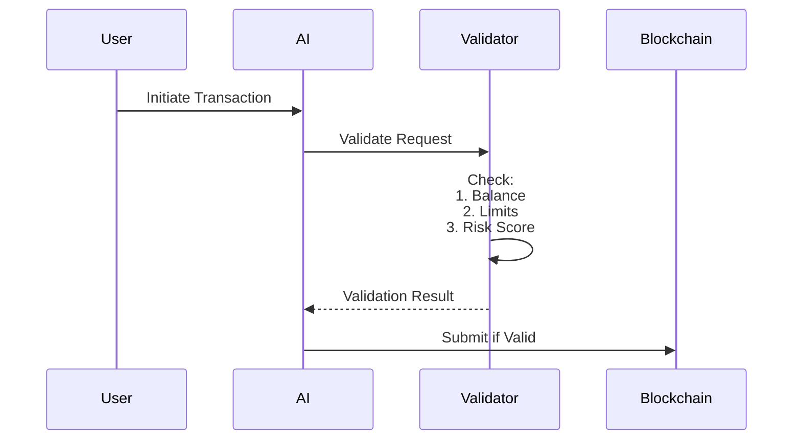
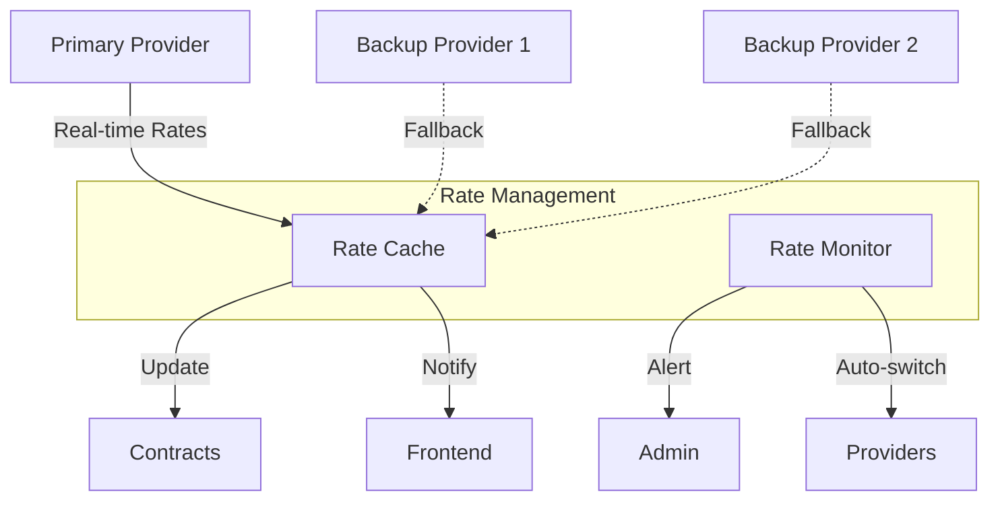
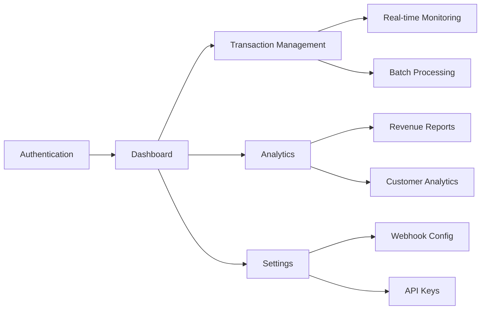
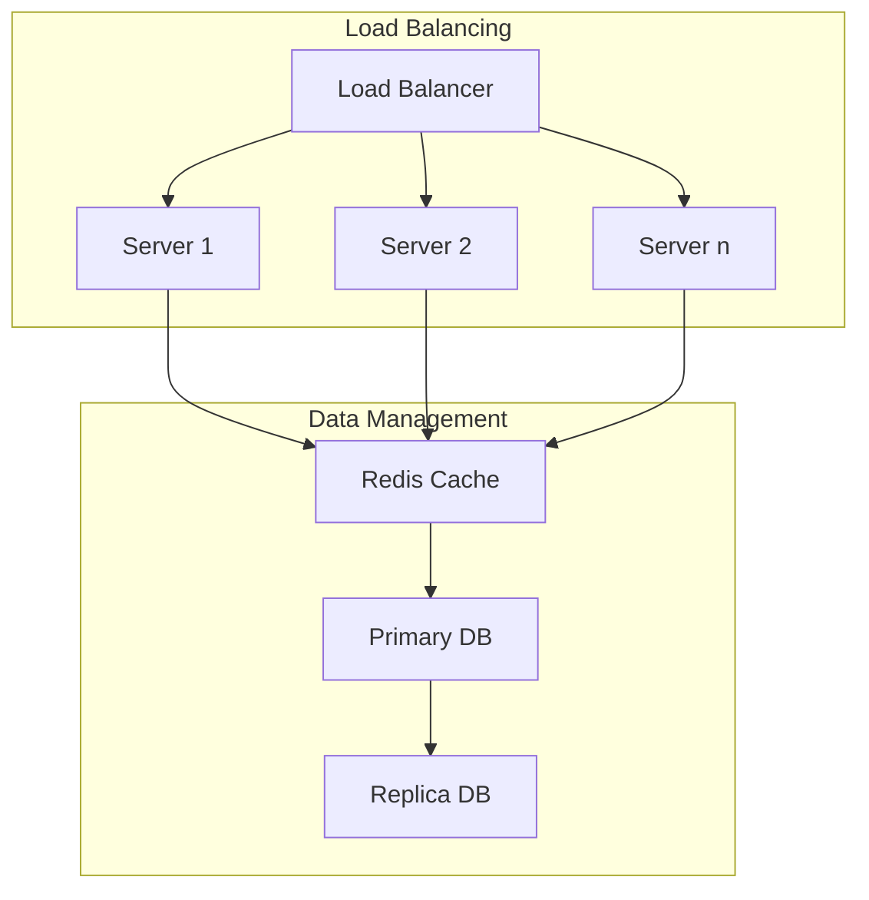
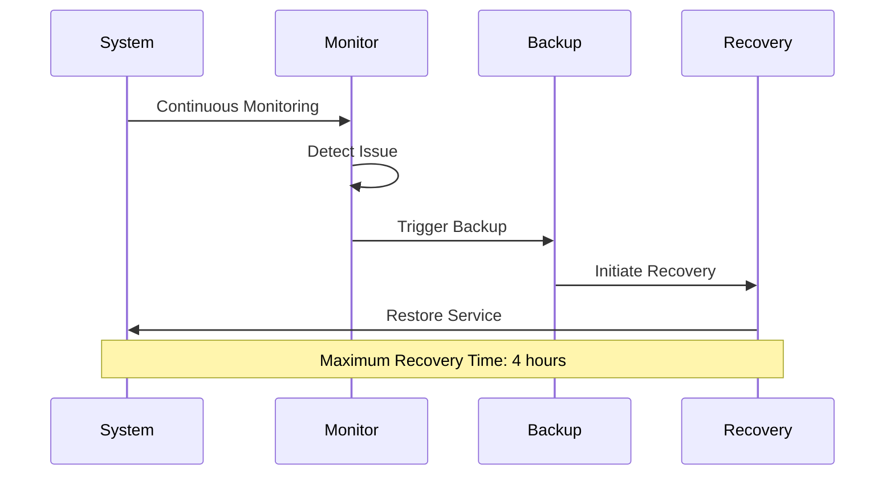
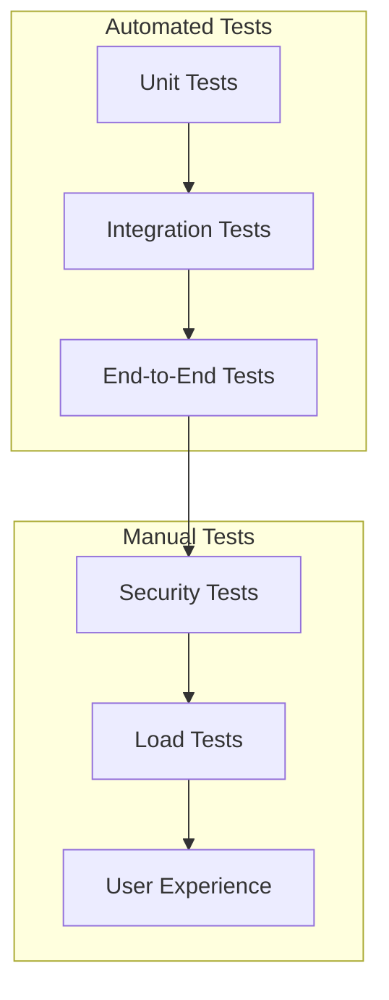

# Next Steps for AurumStk Platform

This document outlines the key technical aspects that need to be documented and implemented to enhance the AurumStk platform.

## 1. Security & Transaction Validation

### Smart Contract Security
- [ ] Implement multi-signature wallet support for high-value transactions
- [ ] Add time-locks for large transfers
- [ ] Develop circuit breakers for unusual activity
- [ ] Create comprehensive audit procedures

### Transaction Validation

## 2. Exchange Rate Integration

### Provider Integration
- [ ] Primary exchange rate provider
- [ ] Backup providers for redundancy
- [ ] Rate caching mechanism
- [ ] Slippage protection

### Rate Update Flow

## 3. Merchant Integration

### API Integration
- [ ] REST API documentation
- [ ] WebSocket endpoints for real-time updates
- [ ] Webhook configuration
- [ ] SDK development for major platforms

### Merchant Dashboard Features

## 4. Performance & Scaling

### Monitoring Metrics
- [ ] Transaction throughput
- [ ] Response times
- [ ] Error rates
- [ ] Resource utilization

### Scaling Strategy

## 5. Backup & Recovery

### Backup Procedures
- [ ] Smart contract state backups
- [ ] Database backup strategy
- [ ] Configuration backups
- [ ] User data protection

### Recovery Plan

## 6. Implementation Priority

1. **High Priority**
   - Security measures
   - Exchange rate integration
   - Basic merchant API

2. **Medium Priority**
   - Performance monitoring
   - Advanced merchant features
   - Scaling infrastructure

3. **Future Enhancements**
   - Additional backup procedures
   - Advanced analytics
   - Extended API features

## 7. Technical Debt Management

- [ ] Code quality metrics
- [ ] Documentation updates
- [ ] Test coverage
- [ ] Dependency updates
- [ ] Security patches

## 8. Integration Testing

### Test Scenarios

## 9. Documentation Requirements

1. **API Documentation**
   - OpenAPI/Swagger specifications
   - Integration guides
   - Example implementations

2. **System Architecture**
   - Component diagrams
   - Sequence diagrams
   - Deployment guides

3. **Security Documentation**
   - Security protocols
   - Audit procedures
   - Incident response

4. **Maintenance Guides**
   - Troubleshooting
   - Monitoring
   - Recovery procedures
