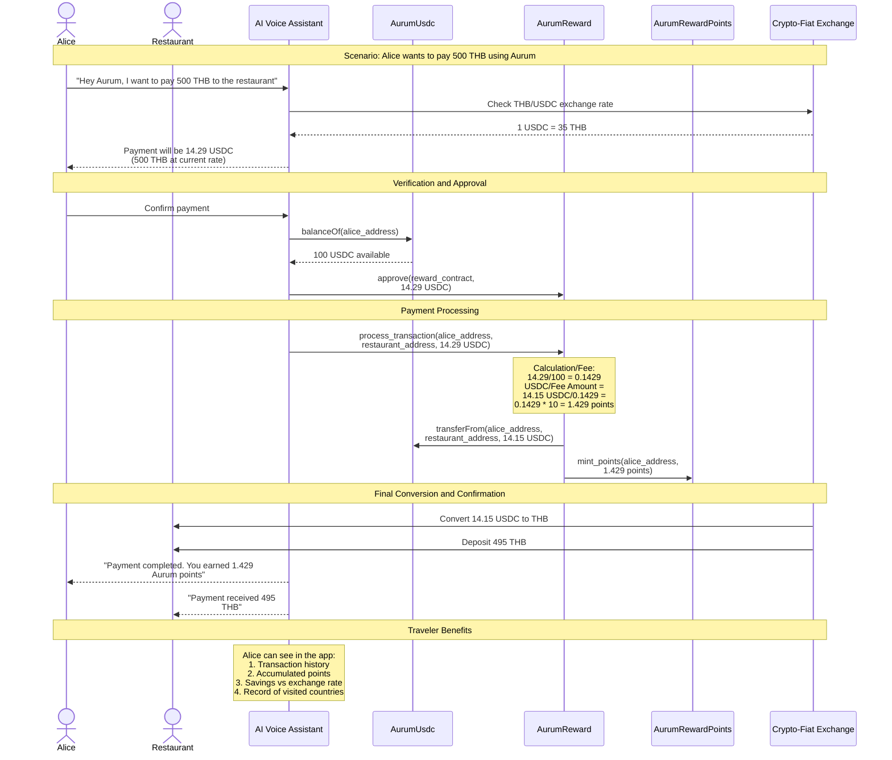
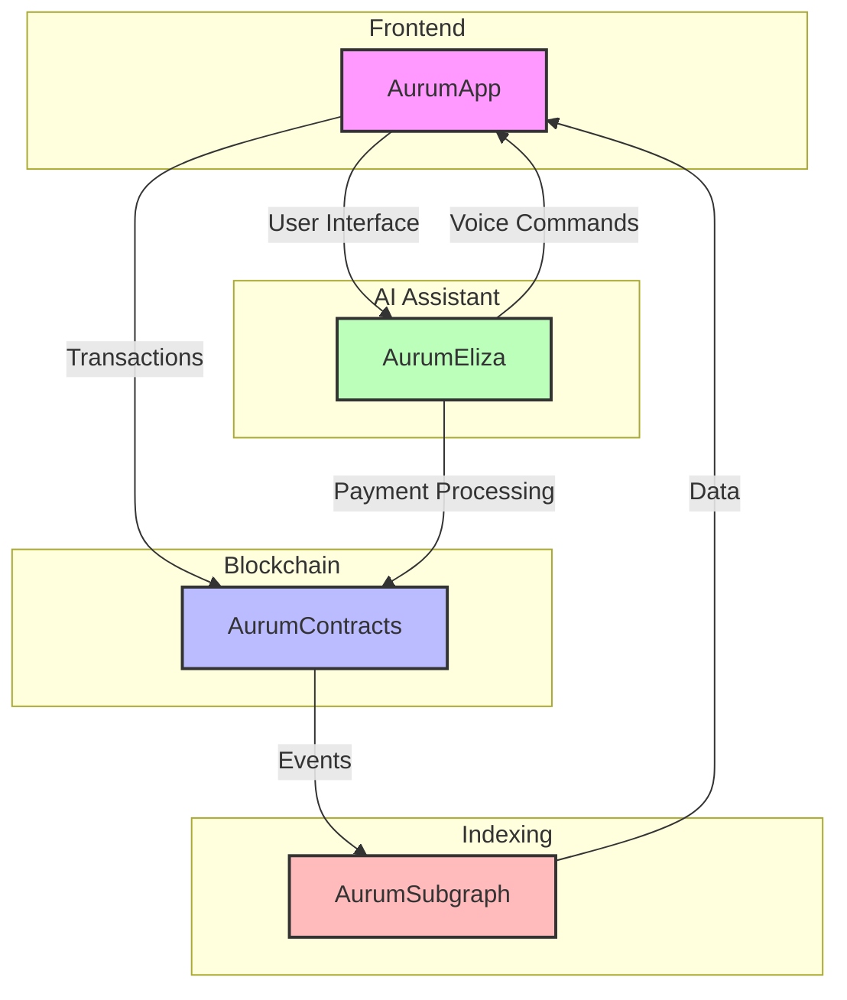

# AurumStk Platform

AurumStk is a comprehensive platform that enables seamless cryptocurrency payments and rewards for international travelers. The platform consists of multiple components that work together to provide a complete payment and rewards solution.

## Use Case: International Travel Payment

Alice, a traveler in Thailand, wants to pay 500 THB at a local restaurant using cryptocurrency through Aurum:

## Project Components

## Project Documentation Index

### 1. AurumApp (Frontend)
- [Documentation](AurumApp/README.md)
- **Key Features**:
  - Customer Portal
  - Merchant Dashboard
  - AI Chat Interface
  - Payment Processing
  - Rewards Tracking

### 2. AurumContracts (Smart Contracts)
- [Documentation](AurumContracts/README.md)
- **Components**:
  - AurumUsdc: Stablecoin Implementation
  - AurumReward: Transaction & Fee Processing
  - AurumRewardPoints: Loyalty Points System

### 3. AurumEliza (AI Assistant)
- [Documentation](AurumEliza/README.md)
- **Features**:
  - Voice Command Processing
  - Multi-language Support
  - Payment Assistant
  - Location Services
  - Rewards Management

### 4. AurumSubgraph (Data Indexing)
- [Documentation](AurumSubgraph/README.md)
- **Functionality**:
  - Event Tracking
  - Transaction History
  - Rewards Analytics
  - Performance Metrics

## System Interaction Flow

1. **User Interaction**
   - User speaks to AI Assistant through AurumApp
   - Voice commands are processed by AurumEliza
   - Payment requests are validated and formatted

2. **Payment Processing**
   - AurumContracts handle transaction execution
   - Fees are calculated and collected
   - Reward points are minted automatically
   - Fiat conversion is processed

3. **Data Management**
   - AurumSubgraph indexes all transactions
   - Events are processed and stored
   - Analytics are generated
   - Frontend is updated in real-time

4. **User Feedback**
   - Transaction confirmation
   - Points balance update
   - Exchange rate information
   - Travel benefits tracking

## Development Setup

Each component has its own setup requirements. Please refer to individual project READMEs for detailed instructions:

- [AurumApp Setup](AurumApp/README.md#setup-instructions)
- [AurumContracts Setup](AurumContracts/README.md#development-setup)
- [AurumEliza Setup](AurumEliza/README.md#development-setup)
- [AurumSubgraph Setup](AurumSubgraph/README.md#setup-and-development)
